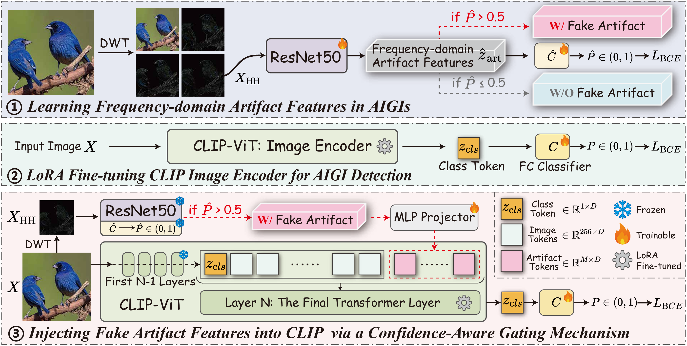

# ArtGate

论文 **“ArtGate: Injecting Fake Artifact Features into CLIP for AI-Generated Image Detection”** 官方代码，已被 IEEE Transactions on Multimedia 接收。



## 环境配置

本项目只支持 NVIDIA GPU 推理，推荐使用 Python 3.10。下面的命令从创建环境开始，可以直接依次执行。

### 1. 创建 Conda 环境

```bash
conda create -n artgate python=3.10 -y
conda activate artgate
python -m pip install --upgrade pip setuptools wheel
```

### 2. 安装 CUDA 版 PyTorch

安装 CUDA 11.8 版本：

```bash
python -m pip install torch==2.1.0 torchvision==0.16.0 torchaudio==2.1.0 --index-url https://download.pytorch.org/whl/cu118
```

### 3. 安装项目依赖

在 ArtGate 仓库根目录执行：

```bash
python -m pip install -r requirements.txt
```

## 模型权重

从 [Google Drive](https://drive.google.com/drive/folders/1jK0BC6_rRx9f9yWn8MJoGfQYLpRy7e9T?usp=sharing) 下载 `model_artgate_progan.pth`，放到 `weights/` 目录即可。

## 数据集

下载 [AIGCDetectBenchMark](https://github.com/Ekko-zn/AIGCDetectBenchmark)。`--dataset_root` 指向包含 `progan`、`stylegan` 等子目录的路径；每个测试子集内应包含 `0_real/` 和 `1_fake/`。

## 评测

下面所有命令默认使用物理 0 号 GPU。

### 单图像推理

```bash
CUDA_VISIBLE_DEVICES=0 python ArtGate_eval.py \
  --model_path ./weights/model_artgate_progan.pth \
  --image_path figure.png
```

命令会以 JSON 格式输出预测类别、伪造概率和模型原始 logit：

```json
{
  "image": "/home/ubuntu/2026/ArtGate/figure.png",
  "prediction": "real",
  "fake_probability": 0.17971085011959076,
  "logits": [-1.5183076858520508]
}
```

### 数据集评测

```bash
CUDA_VISIBLE_DEVICES=0 python ArtGate_eval.py \
  --model_path ./weights/model_artgate_progan.pth \
  --dataset_root /path/to/AIGCDetectBenchMark/test
```

使用随机 JPEG 压缩进行测试：

```bash
CUDA_VISIBLE_DEVICES=0 python ArtGate_eval.py \
  --model_path ./weights/model_artgate_progan.pth \
  --dataset_root /path/to/AIGCDetectBenchMark/test \
  --noise_type jpeg
```

每个测试子集最多读取 100 张真实图像和 100 张伪造图像，进行快速测试：

```bash
CUDA_VISIBLE_DEVICES=0 python ArtGate_eval.py \
  --model_path ./weights/model_artgate_progan.pth \
  --dataset_root /path/to/AIGCDetectBenchMark/test \
  --max_test_image 100
```

CSV 结果保存在 `results/ArtGate/`。如需使用其他 GPU，将命令中的 `CUDA_VISIBLE_DEVICES=0` 改为对应的物理显卡编号，例如 `CUDA_VISIBLE_DEVICES=1`。

## 致谢

本项目受益于以下开源仓库提供的实现与思路。感谢相关作者公开代码和资源：

- [SAFE](https://github.com/Ouxiang-Li/SAFE)
- [AIGCDetectBenchmark](https://github.com/Ekko-zn/AIGCDetectBenchmark)

## 引用

如果本项目对您的研究有所帮助，请引用我们的论文：

```bibtex
@article{fan2026artgate,
  title={ArtGate: Injecting Fake Artifact Features into CLIP for AI-Generated Image Detection},
  author={Fan, Zheming and Zhu, Guopu and Sun, Long and Ding, Feng and Zhang, Hongli and Wu, Ligang},
  journal={IEEE Transactions on Multimedia},
  year={2026},
  publisher={IEEE}
}
```
